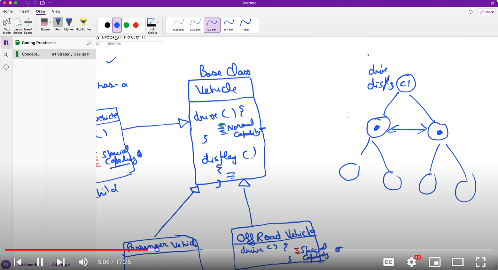

Strategy Design pattern

The need of this design parent arise when
1) There is parent child relationship
2) And more than 1 child override the parent method and the implementation for that method in both the child is same
